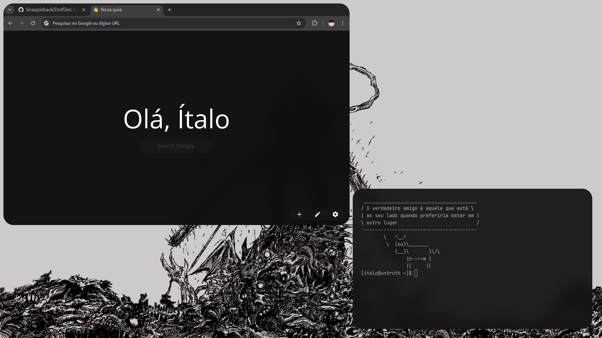
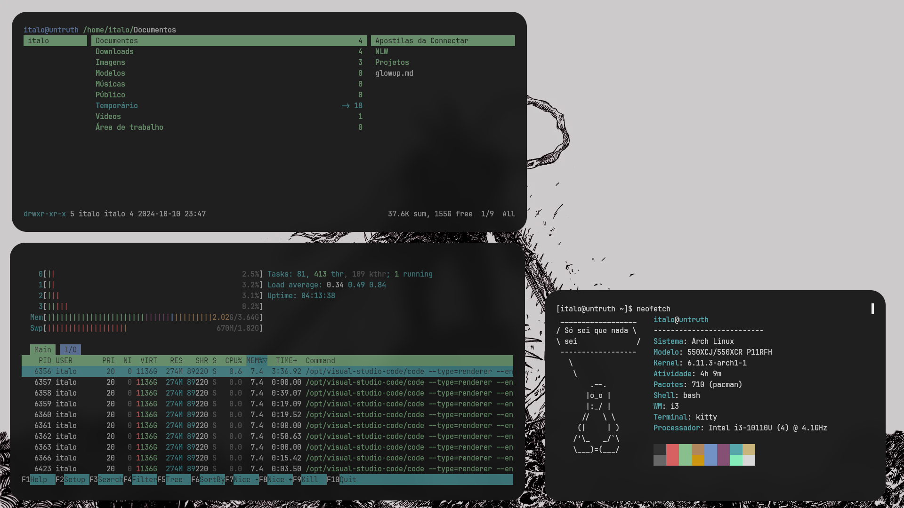

<div align="center">

# Dotfiles

Compartilhando a forma de como eu utilizo meu computador, minha persolização pessoal, aqui listados alguns sofwares que utili etc. 🙂

</div>

# Introdução

Este repositório contém minhas configurações pessoais para o gerenciador de janelas i3wm no Arch Linux. Aqui estão detalhes sobre os softwares, imagens e papéis de parede que utilizo. Sou um usuário simples ;)





## Tema da Nova Aba

Para personalizar minha nova aba, utilizo a extensão NightTab com a seguinte personalização/configuração:

<details>
<summary>Tema</summary>

```json
{"nightTab":true,"version":"7.5.0","state":{"language":"system","layout":{"area":{"header":{"width":76,"justify":"center"},"bookmark":{"width":78,"justify":"center"}},"alignment":"center-center","order":"header-bookmark","direction":"vertical","size":76,"width":60,"padding":64,"gutter":50,"breakpoint":"xs","scrollbar":"none","title":"Nova guia","favicon":"https://images.emojiterra.com/google/noto-emoji/unicode-15.1/color/svg/1f44b.svg","overscroll":{"active":false,"unblur":false}},"header":{"item":{"justify":"center"},"greeting":{"show":true,"type":"none","custom":"Opaa","name":"Opa, Ítalo!","size":400,"newLine":false},"transitional":{"show":false,"type":"time-and-date","size":124,"newLine":false},"clock":{"hour":{"show":false,"display":"number"},"minute":{"show":false,"display":"number"},"second":{"show":false,"display":"number"},"separator":{"show":true,"text":""},"meridiem":{"show":false},"hour24":{"show":true},"size":500,"newLine":false},"date":{"day":{"show":false,"display":"word","weekStart":"monday","length":"long"},"date":{"show":false,"display":"number","ordinal":false},"month":{"show":false,"display":"word","length":"short","ordinal":true},"year":{"show":false,"display":"number"},"separator":{"show":true,"text":""},"format":"date-month","size":160,"newLine":true},"search":{"show":true,"width":{"by":"custom","size":50},"engine":{"selected":"google","custom":{"name":"","url":"","queryName":""}},"text":{"justify":"center"},"size":141,"newLine":true,"newTab":false,"string":""},"order":["greeting","search"],"edit":false},"bookmark":{"size":92,"url":{"show":false},"line":{"show":false},"shadow":{"show":true},"hoverScale":{"show":true},"orientation":"bottom","style":"block","newTab":false,"edit":false,"add":false,"show":false,"item":{}},"group":{"area":{"justify":"center"},"order":"header-body","name":{"size":100},"toolbar":{"size":100},"edit":false,"add":false},"toolbar":{"location":"corner","position":"bottom-right","size":90,"accent":{"show":false},"add":{"show":true},"edit":{"show":true},"newLine":false},"theme":{"color":{"range":{"primary":{"h":0,"s":0}},"contrast":{"start":0,"end":100},"shades":14},"accent":{"hsl":{"h":0,"s":0,"l":100},"rgb":{"r":255,"g":255,"b":255},"random":{"active":false,"style":"any"},"cycle":{"active":false,"speed":300,"step":10}},"font":{"display":{"name":"Open Sans","weight":400,"style":"normal"},"ui":{"name":"Open Sans","weight":400,"style":"normal"}},"background":{"type":"color","color":{"hsl":{"h":0,"s":0,"l":6},"rgb":{"r":15,"g":15,"b":15}},"gradient":{"angle":160,"start":{"hsl":{"h":206,"s":16,"l":40},"rgb":{"r":86,"g":104,"b":118}},"end":{"hsl":{"h":219,"s":28,"l":12},"rgb":{"r":22,"g":28,"b":39}}},"image":{"url":"","blur":0,"grayscale":0,"scale":100,"accent":0,"opacity":100,"vignette":{"opacity":0,"start":90,"end":70}},"video":{"url":"","blur":0,"grayscale":0,"scale":100,"accent":0,"opacity":100,"vignette":{"opacity":0,"start":90,"end":70}}},"opacity":{"general":100},"layout":{"color":{"by":"theme","hsl":{"h":0,"s":0,"l":0},"rgb":{"r":0,"g":0,"b":0},"blur":0,"opacity":10},"divider":{"size":0}},"header":{"color":{"by":"theme","hsl":{"h":0,"s":0,"l":0},"rgb":{"r":0,"g":0,"b":0},"opacity":10},"search":{"opacity":100}},"bookmark":{"color":{"by":"theme","opacity":10,"hsl":{"h":0,"s":0,"l":0},"rgb":{"r":0,"g":0,"b":0}},"item":{"border":0,"opacity":100}},"group":{"toolbar":{"opacity":100}},"toolbar":{"opacity":100},"style":"dark","radius":260,"shadow":0,"shade":{"opacity":4,"blur":4},"custom":{"all":[],"edit":false}},"search":false,"modal":false,"menu":true},"bookmark":[]}
```

</details>

## Sofware utilizados

Irei colocar os programas abaixo que eu instalo para deixar o meu sistema assim. Eu tenho algumas fontes extras que não utilizo, mas caso eu quero mudar de fonte, já tem a opção, aqui as fontes que utilizo no meu sistema:

<details> <summary>Fontes que utilizo no meu sistema</summary>

    ```text
    pacman -S ttf-jetbrains-mono ttf-jetbrains-mono-nerd ttf-nerd-fonts-symbols ttf-nerd-fonts-symbols-common ttf-nerd-fonts-symbols-mono ttf-noto-nerd
    ```

</details>

Fora essas fontes, eu tenho mais uns pingados de sofwares que dá de se resumir em uma lista, se eu esquecer de alguma coisa é só avisar!

<details> <summary>Listagem de programas utilizados</summary>
  
  -   **Edição de Imagens:**
      -   `GIMP`: Um poderoso editor de imagens de código aberto com uma ampla gama de recursos
      -   `Inkscape`: Uma ferramenta de design vetorial de código aberto para criar e editar gráficos vetoriais
  -   **Edição de Código e Arquivos:**
      -   `Vim`: Um editor de texto altamente configurável construído para eficiência
      -   `Visual Studio Code`: Um editor de código-fonte desenvolvido pela Microsoft com suporte a várias linguagens e recursos de desenvolvimento
  -   **Visualização de Imagens:**
      -   `Feh`: Um visualizador de imagem leve para exibir imagens em sistemas X11
      -   `W3M`: Um navegador de texto para a linha de comando
  -   **Papel de Parede:**
      -   `Nitrogen`: Um gerenciador de papéis de parede para definir e manter o plano de fundo da área de trabalho
  -   **Lançador de Aplicativos:**
      -   `Rofi`: Um seletor de aplicativos e lançador de janelas altamente personalizável
  -   **Captura de Tela:**
      -   `Main`: Uma ferramenta de captura de tela rápida e eficiente
      -   `Xclip`: Um utilitário para interagir com a área de transferência do X
      -   `Xdotool`: Uma ferramenta para automatizar interações com janelas X
  -   **Controle de Brilho:**
      -   `Brightnessctl`: Uma ferramenta para controlar o brilho da tela em sistemas que suportam o controle de brilho
  -   **Controle de Áudio:**
      -   `Pactl`: Uma interface de linha de comando para controlar o PulseAudio, o sistema de som padrão do Linux. Ele já veio padrão, não precisei instalar
      -   `Playerctl`: Um utilitário para controlar players de música via linha de comando
  -   **Modo Noturno:**
      -   `Redshift`: Um aplicativo que ajusta a temperatura da cor da tela de acordo com a hora do dia para reduzir a fadiga ocular
  -   **Conectividade Bluetooth:**
      -   `Bluetoothctl`, `Blueman`, `Bluez` e `Bluez-utils`: Conjunto de ferramentas para configurar e gerenciar dispositivos Bluetooth no Linux
  -   **Informações da Bateria:**
      -   `Acpi`: Um utilitário para exibir informações sobre dispositivos ACPI, incluindo bateria
  -   **Gerenciador de Arquivos:**
      -   `Ranger`: Um gerenciador de arquivos baseado em texto para a linha de comando, com navegação estilo Vim
  -   **Personalização do Ambiente:**
      -   `Lxappearance`: Uma ferramenta para personalizar o tema GTK e o ícone do cursor do mouse
      -   `Lightdm-gtk-greeter-settings`: Um utilitário de configuração para o LightDM, um gerenciador de exibição
  -   **Bordas Arredondadas, Blur, etc.:**
      -   `Picom`: Um compositor leve que fornece transparência, sombras e outras efeitos visuais para gerenciadores de janelas
  -   **Terminal:**
      -   `Kitty`: Um emulador de terminal altamente configurável e performático
  -   **Notificações:**
      -   `Dunst`: Um leve e personalizável daemon de notificações para sistemas X11
  -   **AUR:**
      -   `Yay`: Um gerenciador de pacotes AUR (Arch User Repository) para facilitar a instalação de software não oficial no Arch Linux
  -   **Navegador Web:**
      -   `Google Chrome` ou `Chromium`: Navegadores da Web desenvolvidos pelo Google, conhecidos por sua rapidez e suporte a tecnologias web modernas. Utilizo mais sites online, então me serve muito um navegador
  - **Economia de Energia:**
    -   `TLP`: Um utilitário para gerenciar a eficiência energia do sistema
    -   `CpuPower`: Um utilitário para gerenciar a eficiência da CPU do sistema
  -   **Barra de Status:**
      -   `i3blocks`: Um gerenciador de status modular para a barra do i3wm, que permite exibir informações como volume, bateria, data, uso de CPU/RAM, entre outros, por meio de scripts personalizáveis

</details>

## Papéis de parede

Os Papéis de parede incluídos neste repositório são usados para personalizar a aparência do sistema, e gostaria de destacar que alguns dos Papéis de parede utilizados não possui informações claras sobre a licença e o autor. Eu fiz uma busca, mas não consegui encontrar informações

Caso você seja o autor desse papel de parede ou tenha informações sobre a licença, por favor, entre em contato para que eu possa atribuir corretamente os créditos

## Tema e ícones

-   **Tema: [Orchis](https://github.com/vinceliuice/Orchis-theme) (Variação de cor: Gray)**
    -   O Orhis é um tema popular que apresenta uma aparência moderna e limpa em sistemas operacionais Linux. A variação de cor Gray do tema oferece uma paleta de cores suaves e elegantes, que combinam bem com a maioria das interfaces gráficas de usuário
-   **Ícones: [Papyrus](https://github.com/PapirusDevelopmentTeam/papirus-icon-theme)**
    -   Os ícones Papyrus são conhecidos por sua aparência nítida e detalhada, o que os torna ideais para uso em telas de alta resolução. Eles também têm uma grande variedade de ícones disponíveis, cobrindo muitas categorias diferentes de aplicativos e pastas
-   **Cursor: [Simp1e](https://gitlab.com/cursors/simp1e)**
    -   Como descrito pelo criador "An aesthetic cursor theme for Linux desktops" ou para quem não fala árabe "Um elegante tema de cursor para ambientes de desktop Linux"

## Contribuição

Sinta-se à vontade para explorar, utilizar e adaptar meus dotfiles de acordo com suas necessidades. Se você encontrar algum problema ou tiver sugestões de melhoria, fique à vontade para abrir uma issue ou enviar uma solicitação de pull

## Licença

Este projeto é licenciado sob a [Licença MIT](./LICENSE). Veja o arquivo `LICENSE` para obter mais detalhes

> **Nota:** Tenha cuidado ao utilizar essas configurações em seu sistema. É recomendado que você faça backup de seus arquivos de configuração existentes antes de substituí-los pelos fornecidos neste repositório
