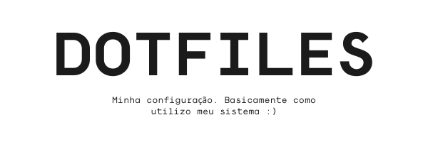
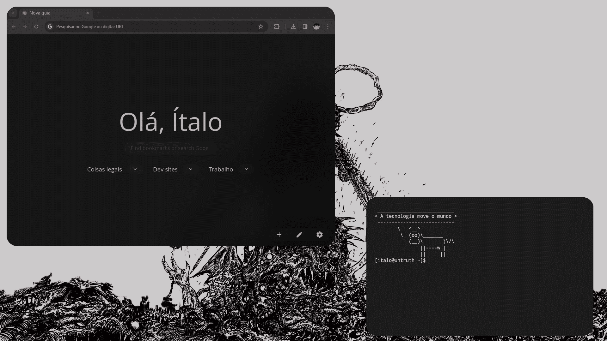
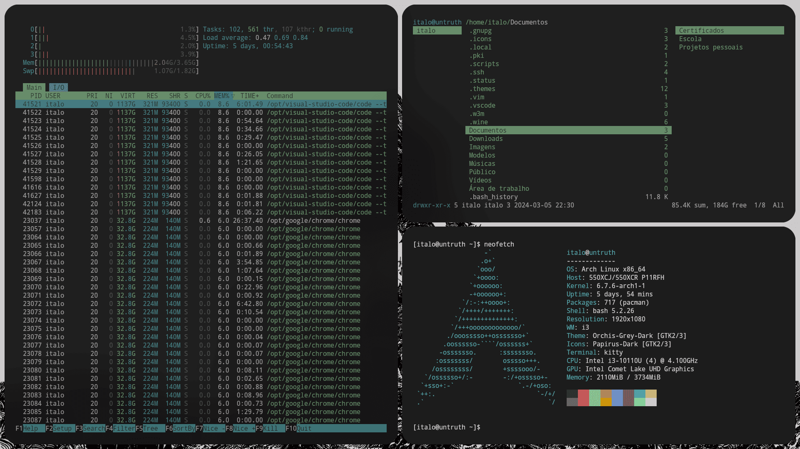

<div align="center">
    <picture>
        <source
            media="(prefers-color-scheme: dark)"
            srcset="./images/headers/main-header-dark.png"
        />
        <source
            media="(prefers-color-scheme: light)"
            srcset="./images/headers/main-header-light.png"
        />
        
    </picture>
</div>

# Introdução

Este repositório contém minhas configurações pessoais para o gerenciador de janelas i3wm no Arch Linux. Aqui estão detalhes sobre os softwares, imagens e papéis de parede que utilizo. Sou um usuário simples ;)





## Sofware que utilizados

Irei colocar os programas abaixo que eu instalo para deixar o meu sistema assim. Eu tenho algumas fontes extras que não utilizo, mas caso eu quero mudar de fonte, já tem a opção, aqui as fontes que utilizo no meu sistema:

```bash
pacman -S ttf-anonymouspro-nerd ttf-dejavu-nerd ttf-droid ttf-firacode-nerd ttf-go-nerd  ttf-hack-nerd ttf-jetbrains-mono-nerd ttf-liberation-mono-nerd ttf-nerd-fonts-symbols ttf-nerd-fonts-symbols-common ttf-nerd-fonts-symbols-mono ttf-noto-nerd ttf-roboto-mono-nerd ttf-sourcecodepro-nerd ttf-space-mono-nerd ttf-terminus-nerd ttf-ubuntu-mono-nerd ttf-ubuntu-nerd ttf-victor-mono-nerd otf-droid-nerd otf-firamono-nerd otf-monaspace-nerd noto-fonts noto-fonts-cjk noto-fonts-emoji noto-fonts-extra
```

Fora essas fontes, eu tenho mais uns pingados de sofwares que dá de se resumir em uma lista, se eu esquecer de alguma coisa é só avisar!

- **Edição de Imagens:**
  - `GIMP`: Um poderoso editor de imagens de código aberto com uma ampla gama de recursos
  - `Inkscape`: Uma ferramenta de design vetorial de código aberto para criar e editar gráficos vetoriais
- **Edição de Código e Arquivos:**
  - `Nano`: Um editor de texto simples e fácil de usar na linha de comando
  - `Vim`: Um editor de texto altamente configurável construído para eficiência
  - `Visual Studio Code`: Um editor de código-fonte desenvolvido pela Microsoft com suporte a várias linguagens e recursos de desenvolvimento
- **Visualização de Imagens:**
  - `Feh`: Um visualizador de imagem leve para exibir imagens em sistemas X11
  - `W3M`: Um navegador de texto para a linha de comando
- **Papel de Parede:**
  - `Nitrogen`: Um gerenciador de papéis de parede para definir e manter o plano de fundo da área de trabalho
- **Lançador de Aplicativos:**
  - `Rofi`: Um seletor de aplicativos e lançador de janelas altamente personalizável
- **Captura de Tela:**
  - `Main`: Uma ferramenta de captura de tela rápida e eficiente
  - `Xclip`: Um utilitário para interagir com a área de transferência do X
  - `Xdotool`: Uma ferramenta para automatizar interações com janelas X
- **Controle de Brilho:**
  - `Brightnessctl`: Uma ferramenta para controlar o brilho da tela em sistemas que suportam o controle de brilho
- **Controle de Áudio:**
  - `Pactl`: Uma interface de linha de comando para controlar o PulseAudio, o sistema de som padrão do Linux. Ele já veio padrão, não precisei instalar
- **Modo Noturno:**
  - `Redshift`: Um aplicativo que ajusta a temperatura da cor da tela de acordo com a hora do dia para reduzir a fadiga ocular
- **Conectividade Bluetooth:**
  - `Bluetoothctl`, `Blueman`, `Bluez` e `Bluez-utils`: Conjunto de ferramentas para configurar e gerenciar dispositivos Bluetooth no Linux
- **Informações da Bateria:**
  - `Acpi`: Um utilitário para exibir informações sobre dispositivos ACPI, incluindo bateria
- **Gerenciador de Arquivos:**
  - `Ranger`: Um gerenciador de arquivos baseado em texto para a linha de comando, com navegação estilo Vim
- **Personalização do Ambiente:**
  - `Lxappearance`: Uma ferramenta para personalizar o tema GTK e o ícone do cursor do mouse
  - `Lightdm-gtk-greeter-settings`: Um utilitário de configuração para o LightDM, um gerenciador de exibição
- **Bordas Arredondadas, etc.:**
  - `Picom`: Um compositor leve que fornece transparência, sombras e outras efeitos visuais para gerenciadores de janelas
- **Terminal:**
  - `Kitty`: Um emulador de terminal altamente configurável e performático
- **AUR:**
  - `Yay`: Um gerenciador de pacotes AUR (Arch User Repository) para facilitar a instalação de software não oficial no Arch Linux
- **Navegador Web:**
  - `Google Chrome` ou `Chromium`: Navegadores da Web desenvolvidos pelo Google, conhecidos por sua rapidez e suporte a tecnologias web modernas. Utilizo mais sites online, então me serve muito um navegador

## Papéis de parede

Os Papéis de parede incluídos neste repositório são usados para personalizar a aparência do sistema, e gostaria de destacar que alguns dos Papéis de parede utilizados não possui informações claras sobre a licença e o autor. Eu fiz uma busca, mas não consegui encontrar informações

Caso você seja o autor desse papel de parede ou tenha informações sobre a licença, por favor, entre em contato para que eu possa atribuir corretamente os créditos

## Tema e ícones

- **Tema: [Orchis](https://github.com/vinceliuice/Orchis-theme) (Variação de cor: Gray)**
  - O Orhis é um tema popular que apresenta uma aparência moderna e limpa em sistemas operacionais Linux. A variação de cor Gray do tema oferece uma paleta de cores suaves e elegantes, que combinam bem com a maioria das interfaces gráficas de usuário
- **Ícones: [Papyrus](https://github.com/PapirusDevelopmentTeam/papirus-icon-theme)**
  - Os ícones Papyrus são conhecidos por sua aparência nítida e detalhada, o que os torna ideais para uso em telas de alta resolução. Eles também têm uma grande variedade de ícones disponíveis, cobrindo muitas categorias diferentes de aplicativos e pastas
- **Cursor: [Simp1e](https://gitlab.com/cursors/simp1e)**
  - Como descrito pelo criador "An aesthetic cursor theme for Linux desktops" ou para quem não fala árabe "Um elegante tema de cursor para ambientes de desktop Linux"

## Contribuição

Sinta-se à vontade para explorar, utilizar e adaptar meus dotfiles de acordo com suas necessidades. Se você encontrar algum problema ou tiver sugestões de melhoria, fique à vontade para abrir uma issue ou enviar uma solicitação de pull

## Licença

Este projeto é licenciado sob a [Licença MIT](https://github.com/snaggleback/dotfiles/blob/master/LICENSE). Veja o arquivo `LICENSE` para obter mais detalhes

> **Nota:** Tenha cuidado ao utilizar essas configurações em seu sistema. É recomendado que você faça backup de seus arquivos de configuração existentes antes de substituí-los pelos fornecidos neste repositório
